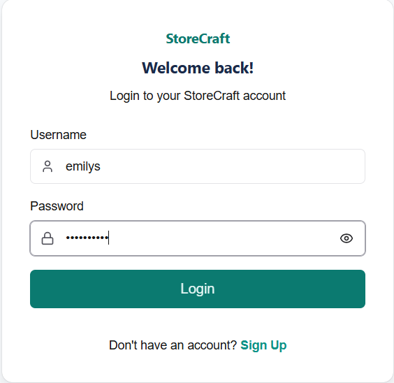
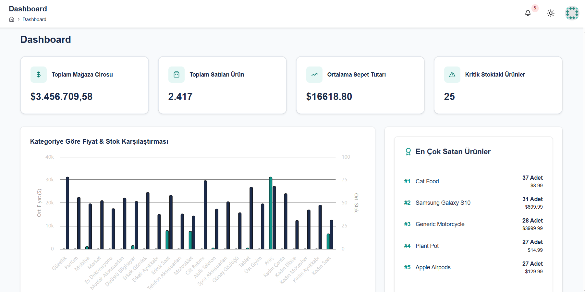
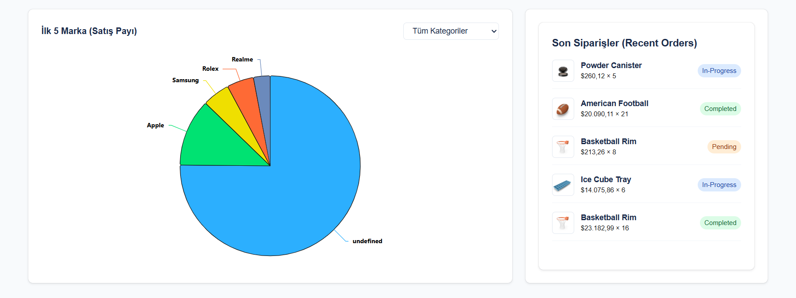
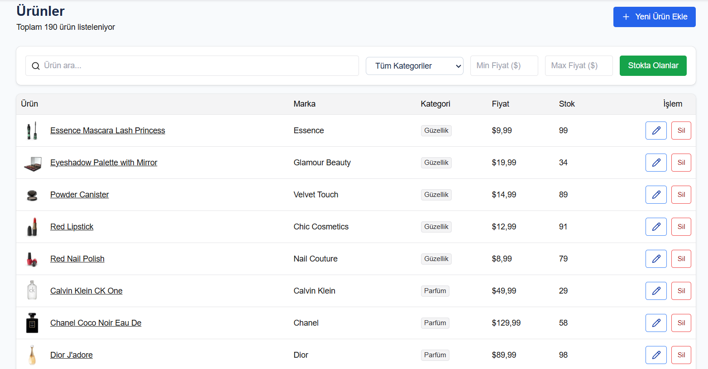
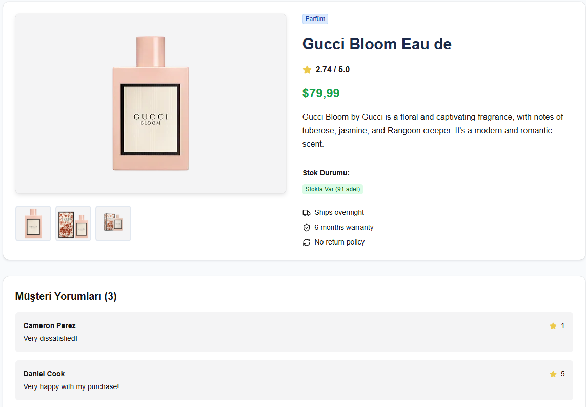
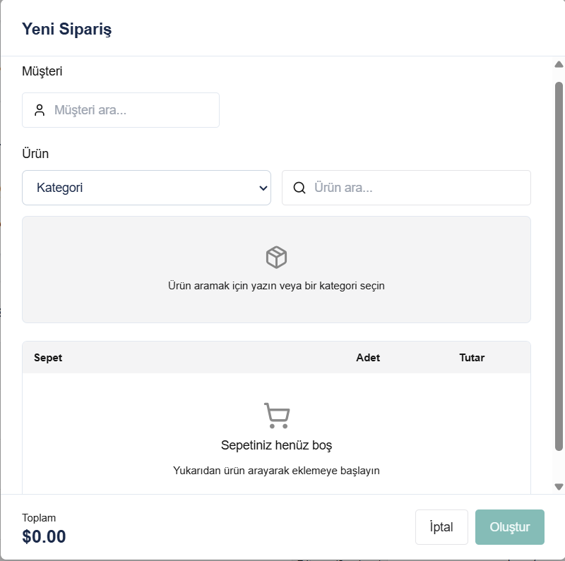
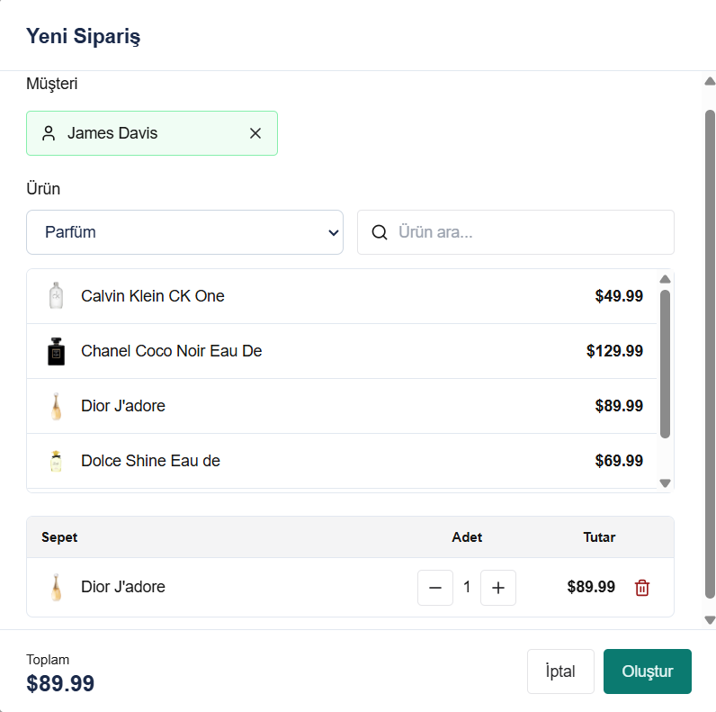

# 🛍️ StoreCraft — E-Commerce Admin Dashboard

StoreCraft, modern bir e-ticaret yönetim panelidir. Ürün yönetimi, sipariş takibi ve analitik raporlama özelliklerini tek bir arayüzde sunar. Gerçek zamanlı veri görselleştirmesi ve sezgisel UX tasarımıyla mağaza operasyonlarını kolaylaştırmak için geliştirilmiştir.

> **Veri Kaynağı:** Tüm veriler [DummyJSON](https://dummyjson.com) public API'sinden çekilmektedir.

---

## ✨ Özellikler

### 🔐 Kimlik Doğrulama

Cookie tabanlı token yönetimi ve Next.js Middleware ile korunan route sistemi. Oturum açmamış kullanıcılar otomatik olarak `/login`'e yönlendirilir; oturum açık kullanıcılar `/login` veya `/register`'a girmeye çalışırsa direkt `/dashboard`'a yönlendirilir.

- Giriş / Kayıt sayfaları (`/login`, `/register`)
- `accessToken` cookie olarak saklanır (1 gün)
- Oturumdan çıkışta spinner animasyonu gösterilir



---

### 📊 Dashboard

Mağazanın genel durumunu tek bakışta görmek için tasarlanmış analitik paneli. Tüm veriler TanStack Query ile parallel olarak çekilir; yükleme tamamlanmadan tam ekran spinner gösterilir.

**Stat Kartları:** Toplam mağaza cirosu · Toplam satılan ürün · Ortalama sepet tutarı · Kritik stok seviyesindeki ürün sayısı (stok < 10)

**Kategori Karşılaştırma Grafiği** — Highcharts column chart ile her kategorinin ortalama fiyatı ve ortalama stoku yan yana görselleştirilir.

**En Çok Satan Ürünler** — Tüm siparişler taranarak en çok sipariş edilen 5 ürün listelenir.



**İlk 5 Marka (Satış Payı)** — Highcharts pie chart; kategori dropdown'ı ile filtrelenebilir. Seçilen kategorideki markaların satış adetleri kıyaslanır.

**Son Siparişler** — Son 5 siparişi ürün görseli, tutar ve durum badge'iyle listeler.



---

### 📦 Ürün Yönetimi (`/products`)

190'dan fazla ürünü tablo halinde listeleyen, tam CRUD destekli sayfa. Filtreler URL'e yansıtıldığı için sayfa yenilendiğinde veya link paylaşıldığında filtreler korunur.

- **Arama:** Ürün adına göre debounced arama (400ms gecikme)
- **Kategori filtresi:** Dropdown ile 30+ kategori arasında seçim
- **Fiyat aralığı:** Min / Max fiyat filtreleri
- **Stok filtresi:** "Stokta Olanlar" toggle butonu
- **CRUD:** Her satırda düzenle (✏️) ve sil butonu; ekleme için sağ üstte "Yeni Ürün Ekle"
- **Optimistik UI:** Ekleme ve silme işlemleri anında listeye yansır, hata durumunda otomatik rollback yapılır
- **Sayfalama:** 10 / 25 / 50 / 100 kayıt seçeneği



Ürün adına tıklanarak detay sayfasına geçilebilir. Detay sayfasında ürün görseli galerisi, açıklama, rating, stok durumu, kargo / garanti / iade bilgileri ve müşteri yorumları yer alır.



---

### 🛒 Sipariş Yönetimi (`/orders`)

Tüm sipariş geçmişini listeleyen, filtrelenebilir ve yeni sipariş oluşturmayı destekleyen sayfa. Sipariş verileri DummyJSON'ın `/carts` endpoint'inden çekilir; her sepete müşteri adı ve mock durum (`Pending / In-Progress / Completed`) eklenerek zenginleştirilir.

**Filtreleme:**
- Müşteri adına göre arama (debounce ile)
- Duruma göre: All / Pending / In-Progress / Completed
- Min / Max tutar filtresi
- Tüm filtreler "Reset Filters" butonuyla sıfırlanır

**Yeni Sipariş Oluşturma Modal'ı** — Boş haliyle açılır; müşteri seçilmeden ve sepete ürün eklenmeden "Oluştur" butonu disabled kalır.



Müşteri autocomplete ile seçilir (yeşil çerçeveyle onaylanır). Ürünler kategoriye göre listelenir veya debounced arama ile bulunur. Sepete eklenen ürünlerin adet ve toplam tutarı anlık hesaplanır. Sipariş oluşturulduğunda **optimistik UI** sayesinde liste beklemeksizin güncellenir.



---

### 👤 Profil & Ayarlar (`/profile`)
- Kullanıcı bilgilerini görüntüleme (avatar, ad, kullanıcı adı, rol)
- Kişisel bilgileri düzenleme: ad, soyad, e-posta, telefon, yaş, boy, kilo
- Adres bilgilerini düzenleme: şehir, ülke
- Zod doğrulama + React Hook Form entegrasyonu
- Kayıt başarısı / hata toast bildirimleri

### 🌙 Dark Mode
- `next-themes` ile sistem temasına uyumlu tam dark mode desteği
- Navbar'da tema değiştirme butonu

### 🔔 Görev / Bildirim Sistemi
- Navbar'daki zil ikonundan erişilen görev listesi (DummyJSON todos API)
- Bekleyen görev sayısı badge olarak gösterilir
- Görevler tamamlandı/bekliyor olarak işaretlenebilir

---

## 🗂️ Proje Yapısı

```
storecraft/
├── app/
│   ├── (auth)/
│   │   ├── login/          # Giriş sayfası
│   │   └── register/       # Kayıt sayfası
│   ├── (dashboard)/
│   │   ├── layout.tsx      # Sidebar + Navbar layout'u
│   │   ├── dashboard/      # Ana dashboard
│   │   ├── orders/         # Sipariş yönetimi
│   │   ├── products/
│   │   │   ├── page.tsx    # Ürün listesi
│   │   │   └── [detay]/    # Ürün detay sayfası
│   │   └── profile/        # Profil & ayarlar
│   ├── layout.tsx          # Root layout (Provider, Toaster, NuqsAdapter)
│   └── globals.css
├── components/
│   ├── CreateOrderModal.tsx
│   ├── CreateProductModal.tsx
│   ├── Navbar.tsx
│   ├── QueryProvider.tsx
│   ├── RecentOrdersCard.tsx
│   ├── Sidebar.tsx
│   ├── StatCard.tsx
│   ├── TopProductsCard.tsx
│   └── ui/                 # Chakra UI primitive wrapper'ları
│       ├── avatar.tsx
│       ├── color-mode.tsx
│       ├── field.tsx
│       ├── menu.tsx
│       ├── password-input.tsx
│       ├── provider.tsx
│       ├── toaster.tsx
│       └── tooltip.tsx
├── hooks/
│   ├── useCreateOrder.ts   # Sipariş oluşturma mantığı
│   ├── useCurrentUser.ts   # Oturum açmış kullanıcı
│   ├── useDashboard.ts     # Dashboard istatistikleri
│   ├── useOrders.ts        # Sipariş listesi & filtreleme
│   ├── useProducts.ts      # Ürün listesi & CRUD & filtreleme
│   └── useTodos.ts         # Görev listesi
├── lib/
│   ├── api.ts              # Axios instance + interceptor'lar
│   ├── auth.ts             # Giriş / mevcut kullanıcı API fonksiyonları
│   ├── categoryLabels.ts   # Kategori slug → Türkçe etiket
│   ├── dashboard.ts        # Dashboard hesaplama fonksiyonları
│   ├── navigation.ts       # Sidebar nav öğeleri
│   ├── orders.ts           # Sipariş API fonksiyonları & veri dönüşümü
│   ├── products.ts         # Ürün API fonksiyonları
│   ├── theme.ts            # Chakra UI özel tema sistemi
│   ├── todos.ts            # Todo API fonksiyonları
│   ├── user.ts             # Kullanıcı profil API fonksiyonları
│   └── validations/
│       ├── auth.ts         # Login / Register Zod şemaları
│       ├── product.ts      # Ürün formu Zod şeması
│       └── user.ts         # Profil formu Zod şeması
├── middleware.ts            # Route koruma (accessToken cookie kontrolü)
├── screenshot/             # README görselleri
└── next.config.ts
```

---

## 🏗️ Mimari & Teknik Kararlar

### API Katmanı (`lib/api.ts`)
- Axios instance ile merkezi HTTP istemcisi
- **Request interceptor:** Her isteğe `Authorization: Bearer <token>` ekler
- **Response interceptor:** Başarılı yanıtlarda `response.data` döndürür; hataları loglar
- `baseURL`: `https://dummyjson.com`

### Veri Yönetimi (TanStack Query)
- **Sunucu state'i** TanStack Query (React Query v5) ile yönetilir
- **Optimistik güncellemeler:** Ürün ekleme/silme ve sipariş oluşturma işlemlerinde UI anında güncellenir, hata olursa eski state'e rollback yapılır
- **Cache & staleTime:** Sık değişmeyen veriler (kategori listesi, kullanıcı map'i) dakikalar boyunca cache'de tutulur

### Route Koruması (`middleware.ts`)
```
/ → token varsa /dashboard, yoksa /login
/login veya /register → token varsa /dashboard
Diğer tüm rotalar → token yoksa /login
```

### Filtreleme Stratejisi
- **Ürünler:** Filtre aktifken tüm veri çekilir, client-side filtrelenir + sayfalanır. Filtresizken server-side sayfalama kullanılır.
- **Siparişler:** Aynı strateji. Siparişlerde `userId → customerName` eşleştirmesi için `getUserMap()` ile önceden hazırlanan `Map<number, string>` kullanılır.

### URL State (nuqs)
Ürünler sayfasındaki filtreler URL query string'e yansıtılır. Sayfa yenilendiğinde veya URL paylaşıldığında filtreler korunur.

---

## 🎨 Tasarım Sistemi

Chakra UI v3 üzerine inşa edilmiş özel tema (`lib/theme.ts`):

| Token | Light | Dark |
|---|---|---|
| `bg.canvas` | `#F8FAFC` | `#05070D` |
| `bg.surface` | `#FFFFFF` | `#0F172A` |
| `text.primary` | `#1B2A4A` | `#F8FAFC` |
| `border.default` | `#E2E8F0` | `#1B2A4A` |
| `accent` (ana renk) | `#0D9488` (teal) | `#0D9488` |

**Tipografi:** Geist Sans + Geist Mono (Next.js Google Fonts entegrasyonu)

---

## 🔧 Teknoloji Yığını

| Katman | Teknoloji |
|---|---|
| Framework | Next.js 16.3 (App Router) |
| UI | Chakra UI v3 + Lucide React Icons |
| Veri Yönetimi | TanStack React Query v5 |
| HTTP İstemcisi | Axios |
| Form Yönetimi | React Hook Form + Zod |
| Grafik Kütüphanesi | Highcharts + highcharts-react-official |
| URL State | nuqs |
| Cookie | js-cookie |
| Tema | next-themes |
| Debounce | use-debounce |
| Dil | TypeScript |
| Stil | Tailwind CSS v4 + Chakra UI |

---

## 🚀 Kurulum ve Çalıştırma

### Gereksinimler
- Node.js 18+
- npm

### Adımlar

```bash
# 1. Bağımlılıkları yükle
npm install

# 2. Geliştirme sunucusunu başlat
npm run dev
```

Uygulama varsayılan olarak [http://localhost:3000](http://localhost:3000) adresinde çalışır.

### Diğer Komutlar

```bash
npm run build   # Production build
npm run start   # Production sunucu
npm run lint    # ESLint kontrolü
```

---

## 🔑 Test Kullanıcısı

Uygulama [DummyJSON](https://dummyjson.com/docs/auth) auth API'sini kullanmaktadır.

```
Kullanıcı Adı: emilys
Şifre:        emilyspass
```

> DummyJSON'ın herhangi bir kullanıcı bilgileriyle giriş yapılabilir.  
> Tam liste için: https://dummyjson.com/users

---

## 📡 Kullanılan API Endpoint'leri

| Endpoint | Açıklama |
|---|---|
| `POST /auth/login` | Giriş & token alma |
| `GET /auth/me` | Mevcut kullanıcı bilgisi |
| `GET /products` | Ürün listesi (sayfalama) |
| `GET /products/search` | Ürün arama |
| `GET /products/category-list` | Kategori listesi |
| `GET /products/:id` | Ürün detayı |
| `POST /products/add` | Ürün ekleme |
| `PUT /products/:id` | Ürün güncelleme |
| `DELETE /products/:id` | Ürün silme |
| `GET /carts` | Sipariş (sepet) listesi |
| `POST /carts/add` | Sipariş oluşturma |
| `GET /users` | Kullanıcı listesi (müşteri map'i için) |
| `PUT /users/:id` | Kullanıcı profili güncelleme |
| `GET /todos/user/:id` | Kullanıcıya ait görev listesi |
| `PUT /todos/:id` | Görev durumu güncelleme |

---

## 📝 Notlar

- **Gerçek backend yok:** Tüm mutasyon işlemleri (ekleme, silme, güncelleme) DummyJSON'ın fake API'sini kullanır. Değişiklikler gerçekte kalıcı değildir.
- **Sipariş durumları mock'tur:** `getMockStatus(id)` fonksiyonu, sipariş ID'sine göre deterministik olarak `Completed / In-Progress / Pending` durumunu atar (`id % 3`).
- **Optimistik UI:** Ağ gecikmesinden bağımsız, anlık geri bildirim sağlamak için ekleme/silme/sipariş oluşturma işlemlerinde optimistik cache güncellemesi uygulanmıştır.
